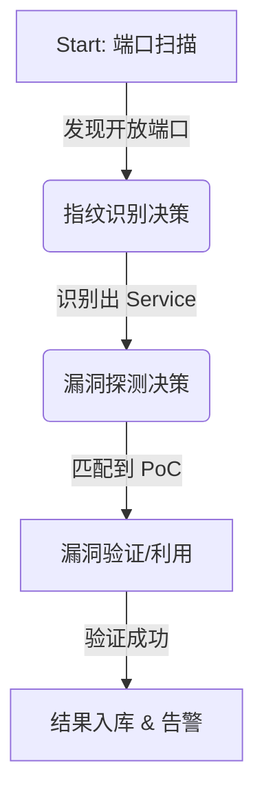

# 后端自动化决策逻辑设计 (Automated Decision Logic)

## 1. 概述
在内网横向移动场景下，后端 (Smart Backend) 不仅仅是任务的触发者，更是**自动化编排大脑 (Orchestrator)**。
本设计定义了从“发现端口”到“验证漏洞”的完整自动化决策链条，确保扫描过程高效、精准且闭环。

## 2. 决策状态机 (State Machine)

后端应维护一个基于事件驱动的状态机，核心流程如下：



## 3. 详细决策逻辑

### 3.1 第一阶段：端口扫描结果决策
**输入**: `{"ip": "192.168.1.5", "port": 6379, "state": "open"}`

**决策逻辑**:
1.  **去重检查**: 该 IP:Port 是否近期（如 24h 内）已扫描过？
    *   *Yes* -> 跳过指纹识别（除非强制刷新）。
    *   *No* -> 进入指纹识别队列。
2.  **协议推断**: 根据常见端口号做初步标记。
    *   `6379` -> 可能为 Redis
    *   `22` -> 可能为 SSH
    *   `80/445/8080` -> HTTP/SMB...

**输出动作**:
*   下发 **指纹识别任务** (Yak Script: `fingerprint.yak`, Target: `192.168.1.5:6379`)

---

### 3.2 第二阶段：指纹识别结果决策
**输入**: `{"ip": "192.168.1.5", "port": 6379, "service": "redis", "version": "5.0.7"}`

**决策逻辑**:
1.  **指纹入库**: 更新 `TaskTarget` 的 `service` 和 `version` 字段。
2.  **漏洞/PoC 匹配 (核心)**:
    *   遍历系统漏洞库 (VulLibraries)，寻找 `Tag` 或 `Keyword` 匹配的 PoC。
    *   *规则示例*:
        *   If Service == `redis` -> 添加 `redis_unauth`, `redis_weak_pass`
        *   If Service == `ssh` -> 添加 `ssh_bruteforce`
        *   If Service == `weblogic` -> 添加 `weblogic_cve_...`
        *   If Service == `http` -> 启动 `web_crawler` (爬虫)

**输出动作**:
*   生成 **漏洞探测任务列表**。
*   下发 **漏洞验证任务** (Yak Script: `redis_check.yak`, Target: `192.168.1.5:6379`)

---

### 3.3 第三阶段：漏洞验证结果决策
**输入**: `{"ip": "192.168.1.5", "vuln": "redis_unauth", "status": "vulnerable", "payload": "config get dir"}`

**决策逻辑**:
1.  **漏洞入库**: 在 `TaskVul` 表创建记录，标记为“高危”。
2.  **利用链升级 (Exploit Chain)**:
    *   如果发现了“可利用漏洞”（如 RCE、未授权写文件），是否自动进行下一步？
    *   *策略*: 
        *   **保守模式**: 仅记录，停止。
        *   **激进模式 (自动横向)**: 
            *   尝试写入 SSH Key (`/root/.ssh/authorized_keys`)。
            *   尝试反弹 Shell。
            *   如果成功获取新 Session -> **递归启动第一阶段** (在该新主机上发起新一轮扫描)。

**输出动作**:
*   发送告警通知 (Webhook/Mail)。
*   (激进模式下) 创建新的 `RemoteSession` 记录。

## 4. 伪代码实现 (services/decision_engine.go)

```go
func (e *DecisionEngine) OnFingerprintResult(ctx context.Context, res FingerprintResult) {
    // 1. 保存指纹
    e.TargetService.UpdateService(res.IP, res.Port, res.Service, res.Version)

    // 2. 匹配 PoC
    var pocs []string
    switch res.Service {
    case "redis":
        pocs = append(pocs, "redis-unauth", "redis-weak-pass")
    case "ssh":
        pocs = append(pocs, "ssh-weak-pass")
    case "mysql":
        pocs = append(pocs, "mysql-weak-pass")
    }

    // 3. 调度执行
    if len(pocs) > 0 {
        // 将这些 PoC 打包成一个 Yak 任务下发给跳板机
        taskID := e.TaskScheduler.CreateVulTask(res.IP, pocs)
        e.RemoteSession.ExecuteYakScript(res.SessionID, "vul_verify.yak", taskID)
    }
}
```

## 5. 关键依赖
*   **指纹库**: 需要精准的指纹识别规则（可复用 Yakit 内置指纹库）。
*   **PoC 映射表**: `Service Name -> PoC List` 的映射关系必须维护在数据库或配置文件中，以便动态更新。
