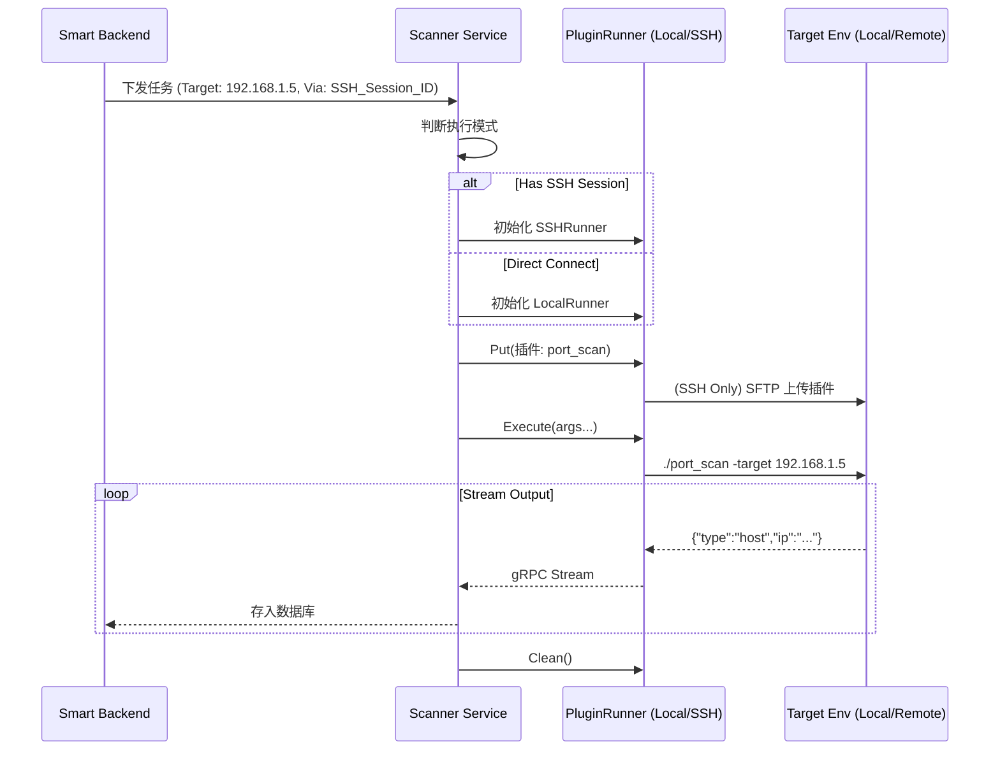

# 统一扫描插件架构设计方案 (Unified Plugin Architecture)

## 1. 核心理念
实现“插件与执行环境解耦”。所有的安全检测能力（资产探测、漏洞扫描、弱口令爆破）都封装为独立的、标准化的**可执行文件（Plugin）**。
Scanner 程序仅作为**调度器（Scheduler）**和**传输层（Transport）**，根据任务上下文决定是在本地运行插件，还是将其投递到跳板机（Jump Host）执行。

## 2. 架构设计

### 2.1 抽象层 (Interface)
定义统一的执行器接口 `PluginRunner`，屏蔽底层差异。

```go
type PluginRunner interface {
    // CheckEnvironment 检查环境是否满足插件运行条件
    CheckEnvironment() error
    // Put 将插件投递到执行环境
    Put(localPath string, remoteName string) (remotePath string, err error)
    // Execute 执行插件并返回输出流
    Execute(ctx context.Context, cmd string, args ...string) (io.ReadCloser, error)
    // Clean 清理残留文件
    Clean(paths ...string) error
}
```

### 2.2 实现层 (Implementations)

#### A. 本地执行器 (LocalRunner)
*   **适用场景**: 扫描外网目标或 Scanner 直连网络。
*   **Put**: 直接返回本地路径（无需移动）。
*   **Execute**: 封装 `os/exec` 调用本地进程。
*   **Clean**: 无需操作（除非产生临时文件）。

#### B. 远程执行器 (SSHRunner)
*   **适用场景**: 内网横向移动、跳板机扫描。
*   **依赖**: `tools/sshutils`。
*   **Put**:
    1.  计算本地插件 Hash。
    2.  检查远程临时目录（如 `/tmp/.cache/`）是否存在同 Hash 文件。
    3.  不存在则通过 SFTP 上传，并赋予 `+x` 权限。
*   **Execute**: 通过 SSH Session 执行命令。
*   **Clean**: 任务结束后删除插件（可选保留以加速下次扫描）。

## 3. 插件规范 (Plugin Standard)

为了确保插件在不同 OS（Linux/Windows）和环境（本地/远程）下都能稳定运行，必须制定严格的开发规范。

### 3.1 形态规范
*   **推荐**: **静态编译的 Go 二进制文件** (Static Binary)。
    *   *原因*: 彻底解决依赖问题（libc 版本、Python 环境缺失等）。
    *   *构建*: `CGO_ENABLED=0 go build -ldflags "-s -w"`。
*   **妥协**: 独立打包的 Python (PyInstaller)。
    *   *缺点*: 体积大 (10MB+)，传输耗时，不推荐用于内网横向。

### 3.2 交互规范
*   **输入**: 仅通过 **命令行参数 (CLI Args)** 接收指令。
    *   例: `./plugin_portscan -target 192.168.1.1 -ports 80,445`
*   **输出**: 仅通过 **标准输出 (Stdout)** 返回结果。
    *   格式: **NDJSON (Newline Delimited JSON)**。
    *   禁止: 不要打印任何非 JSON 的调试日志到 Stdout（可打印到 Stderr）。

## 4. 业务流程 (Workflow)



## 5. 关键技术细节

### 5.1 插件缓存机制 (Smart Caching)
在跳板机模式下，频繁上传同一个插件会浪费大量带宽。
*   **方案**: 在跳板机建立隐藏缓存目录（如 `~/.smart_cache/`）。
*   **逻辑**: 上传前先运行 `md5sum /tmp/plugin`，对比本地 Hash。一致则跳过上传。

### 5.2 跨平台适配 (Cross-Platform)
Scanner 需维护多架构插件库：
*   `plugins/bin/portscan_linux_amd64`
*   `plugins/bin/portscan_windows_amd64.exe`
*   `plugins/bin/portscan_linux_arm64`

SSHRunner 在连接建立初期，需自动执行 `uname -m` 和 `uname -s` 探测目标机架构，从而选择正确的二进制文件进行上传。

## 7. Yakit 引擎集成策略 (Advanced)

针对 "Smart -> Yakit -> Yak Script" 的高级场景，决策逻辑应放置在 **Smart Backend 的 `RemoteSession` 服务** 中。

### 7.1 决策逻辑位置
推荐在 `services/remotesession.go` 中新增 `ExecuteYakScript` 方法，作为内网渗透的统一入口。

*   **位置原因**:
    *   `RemoteSession` 服务持有 SSH 会话的所有权，最清楚哪些主机是活跃的，以及如何连接它们。
    *   它是连接“业务需求”（如：扫一下这个网段）和“底层能力”（SSH 通道）的桥梁。

### 7.2 执行流程 (The Orchestration)

当用户点击“内网扫描”时，Smart Backend 触发以下流程：

1.  **环境检查 (Check)**:
    *   Backend 通过 SSH 检查目标机 `/tmp/yak` 是否存在。
    *   如果不存在或版本过旧，触发 **引擎上传 (Upload Engine)**。
    *   *优化*: Yak 引擎体积较大，建议在首次建立 Session 时异步后台上传，或仅上传精简版 `yak-engine`。

2.  **脚本投递 (Put Script)**:
    *   Backend 将具体的 Yak 脚本（如 `port_scan.yak`）内容写入目标机临时文件 `/tmp/scan_task.yak`。
    *   *优势*: 脚本文件极小，传输几乎瞬间完成。

3.  **命令下发 (Execute)**:
    *   Backend 发送 SSH 命令: `/tmp/yak script /tmp/scan_task.yak --target 192.168.1.0/24 --output-format json`。

4.  **结果回收 (Collect)**:
    *   Backend 实时读取 SSH Stdout。
    *   解析 Yak 脚本输出的 JSON 结果。
    *   存入 `TaskTarget` 和 `TaskVul` 表。

### 7.3 代码伪逻辑 (services/remotesession.go)

```go
// ExecuteYakScript 在指定 Session 上执行 Yak 脚本
func (s *RemoteSessionService) ExecuteYakScript(ctx context.Context, sessionID string, scriptContent string, args map[string]string) error {
    // 1. 获取 Session 实例
    sshClient, err := s.GetSSHClient(sessionID)
    
    // 2. 确保 Yak 引擎就绪 (Lazy Load)
    if !s.IsYakInstalled(sshClient) {
        s.UploadYakEngine(sshClient) // 耗时操作，需异步或带进度条
    }
    
    // 3. 上传脚本文件
    remoteScriptPath := "/tmp/" + uuid.New() + ".yak"
    sshClient.WriteFile(remoteScriptPath, scriptContent)
    defer sshClient.RunCmd("rm " + remoteScriptPath) // 清理
    
    // 4. 构造命令
    cmd := fmt.Sprintf("/tmp/yak script %s", remoteScriptPath)
    for k, v := range args {
        cmd += fmt.Sprintf(" --%s %s", k, v)
    }
    
    // 5. 执行并流式处理结果
    outputStream, _ := sshClient.StreamCmd(cmd)
    go s.ParseAndSaveResults(outputStream)
    
    return nil
}
```

### 7.4 为什么 Yak 是个好选择？
*   **脚本化**: Yak 语言本身就是为安全设计的，写端口扫描、指纹识别比 Go 原生代码快得多。
*   **热更新**: 发现新漏洞，只需在 Server 端更新 `.yak` 脚本，下次扫描自动下发新脚本，无需重新编译上传几百兆的二进制。
